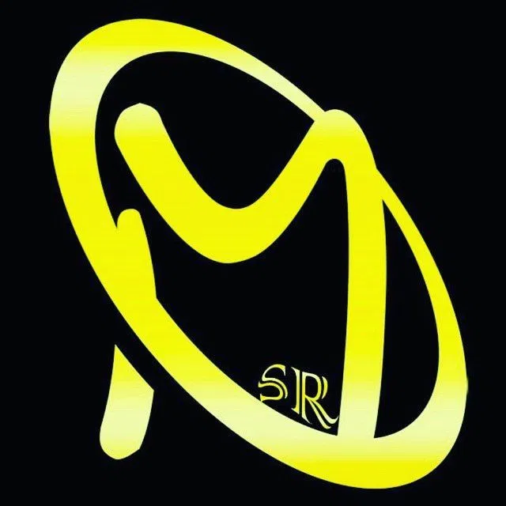

<div align="center">
  <a href="https://msr-ir.github.io">
    
  </a>

  <br />
  <br />

  

  # Mojtaba Sajadfar

  ### Front-End Developer · WebGIS Specialist

  I turn spatial data into interfaces people can actually navigate.

  <br />

  [](https://msr-ir.github.io)
  [](Mojtaba_Sajadfar.pdf)
  [](https://www.linkedin.com/in/mojtaba-sajadfar)

  <br />

  
  
  
</div>

---

## `01. About`

I'm a Front-End Developer with six years of experience building high-performance mapping platforms, progressive web apps, and spatial-data interfaces. I integrate geographic data, customize open-source GIS libraries, and turn complex datasets into products that feel clear and intuitive.

Alongside production work at **Saafaa**, I design and ship full-stack products independently—from database architecture to the final interface.

## `02. Core stack`

<div align="center">


</div>

| Layer | Technologies |
| :--- | :--- |
| **Front end** | HTML · CSS · Sass · Bootstrap · JavaScript · TypeScript · Angular · Ionic · Ng-Zorro |
| **Geospatial** | OpenLayers · ol-ext · Cesium 3D · OGC services · WMS/WFS |
| **Back end & data** | NestJS · Prisma · PostgreSQL · Redis · Firebase |
| **Delivery** | Git · Docker · Jira · REST APIs · MVC · PWA · RBAC |

## `03. Featured builds`

### 🟠 Yooz — Workforce Attendance

> **Personal project · Designed and built solo, end to end**

A mobile HR platform with two-step OTP login, live attendance dashboards, multi-step approval workflows, payroll, push notifications, and an admin console for users, groups, and shifts.

`Angular 20` `Ionic 8` `NestJS` `Prisma` `PostgreSQL` `Redis` `Firebase`

### 🟠 geotajak-sdk

> **Personal npm package · Framework-agnostic OpenLayers toolkit**

A lightweight wrapper with WMS layers, live GetFeatureInfo, drawing and measurement tools, XYZ basemaps, a themeable UI, and ready-made React and Angular examples.

```bash
npm install geotajak-sdk
```

## `04. Production platforms`

| Product | What it does | Focus |
| :--- | :--- | :--- |
| [**Geotajak3 ↗**](https://geotajak.ir/products/geotajak) | Open-source WebGIS core for vector/raster data, 3D maps, satellite imagery, cartography, and workflows | `OGC` `WMS/WFS` `3D` |
| [**Data Catalog ↗**](https://geotajak.ir/products/data-catalog) | Search, preview, download, and metadata management for organizational spatial datasets | `WMS/WFS` `Metadata` |
| [**Accident Analysis ↗**](https://geotajak.ir/products/accident) | Traffic-risk mapping and analysis for road-safety decisions | `Search` `RBAC` `OGC` |
| [**Drilling Management ↗**](https://geotajak.ir/products/drilling) | Digital urban-excavation permits with real-time map monitoring | `Real time` `Permits` |
| [**Fleet Management ↗**](https://geotajak.ir/products/fms) | Live GPS tracking, fleet control, shifts, drivers, and smart alerts | `Live GPS` `Fleet ops` |

## `05. Experience`

```text
2020 ─────────────────────────────────────────────── NOW
       Front-End Developer · Saafaa
       WebGIS products, spatial platforms, fleet and asset systems

2018 ───────────────────────── 2020
       B.Sc. Computer Software Engineering
       Amirkabir University · Arak
```

---

<div align="center">

### Let's build something worth putting on the map.

[](mailto:ms26sr@gmail.com)
[](https://www.linkedin.com/in/mojtaba-sajadfar)

<sub>© 2026 Mojtaba Sajadfar · Built in Yazd, Iran</sub>

</div>
