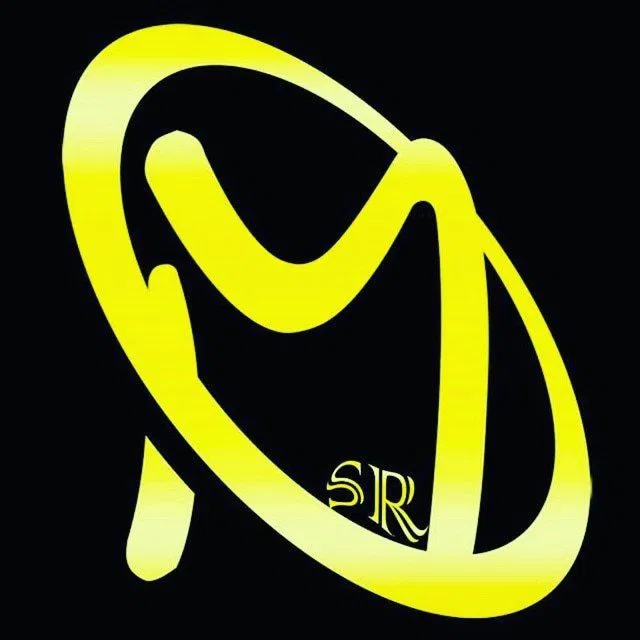

<div align="center">
  <a href="https://msr-ir.github.io">
    
  </a>

  <br />
  <br />

  

  # Mojtaba Sajadfar

  ### Front-End Developer · WebGIS Specialist

  I turn spatial data into interfaces people genuinely enjoy using.

  <br />

  [](https://msr-ir.github.io)
  [](https://msr-ir.github.io/assets/Mojtaba_Sajadfar_EN.pdf)
  [](https://www.linkedin.com/in/mojtaba-sajadfar)

  <br />

  
  
  
</div>

---

## `01. About`

I'm a Front-End Developer based in Yazd, Iran, with six years of experience building high-performance mapping platforms, progressive web apps, and spatial-data interfaces for municipal and national programs. I integrate geographic data, customize open-source GIS libraries, and turn messy, complex datasets into products that feel clear and intuitive.

Outside client work at **Saafaa**, I design and ship full-stack products independently, end to end — from database architecture to the final interface. That includes **Iranzamin**, a full-stack tourism guide built around a custom design system inspired by Achaemenid art and ancient Iran.

## `02. Core stack`

<div align="center">


</div>

| Layer | Technologies |
| :--- | :--- |
| **Front end** | HTML · CSS · Sass · Bootstrap · JavaScript · TypeScript · Angular · Ionic · Ng-Zorro |
| **Geospatial** | OpenLayers · ol-ext · Cesium 3D · OGC services · WMS/WFS/WCS/CSW |
| **Back end & data** | NestJS · Prisma · PostgreSQL · Redis · Firebase |
| **Delivery** | Git · Docker · Jira · REST APIs · MVC · PWA · RBAC |

## `03. Featured builds`

### 🟠 Iranzamin — Historic Iran Tourism Guide

> **Personal project · Designed and built solo, end to end**

A full-stack tourism guide for Iran's historic cities: a NestJS + PostgreSQL API behind a fully custom, hand-drawn interface — no default Ionic components — built around a design system inspired by Achaemenid art and ancient Iran (lotus-inscription borders, Persepolis step patterns, rosette ratings, iwan-arch imagery). Car and pedestrian route planning, an AR view for on-site exploration, place details with reviews, a light/dark home screen, and a full admin console. Fully bilingual (English/Persian), backed by 32 end-to-end tests.

`NestJS` `PostgreSQL` `AR Navigator` `OSRM Routing` `Achaemenid Design System` `Docker`

### 🟠 Yooz — Workforce Attendance

> **Personal project · Designed and built solo, end to end**

A mobile HR platform with two-step OTP login, live attendance dashboards, multi-step approval workflows, payroll, push notifications, and an admin console for users, groups, and shifts.

`Angular 20` `Ionic 8` `NestJS` `Prisma` `PostgreSQL` `Redis` `Firebase`

### 🟠 Waqtnegar (وقت‌نگار) — Jira Worklog Manager

> **Personal project · Mobile & desktop, solo**

A mobile-first time-tracking companion for Jira that talks directly to the Jira REST API v2 with no backend of its own — sign in with a Personal Access Token, browse tasks with JQL-driven filters, move issues through their real workflow, run timers, and submit worklogs. Daily/weekly/monthly reports on a Jalali calendar, inside a Persian RTL dark UI.

`Angular 21` `Ionic 9` `Direct Jira REST v2` `Zoneless` `Signals`

### 🟠 Contacts — Multi-List Contact Manager

> **Personal project · Mobile app, solo**

Multiple contact lists with custom cover photos and colour-coded icons, contacts added manually or pulled from the device's native address book, one-tap dialling, Iranian number validation/auto-formatting, offline-first storage, and a fully RTL Persian UI.

`Angular 20` `Ionic 8` `Capacitor 8` `Offline-first`

### 🟠 shamsi-datepicker

> **Personal project · npm package**

A dependency-free Jalali/Gregorian date & time picker in plain TypeScript: a DOM-free core with thin adapters for Angular, React, and vanilla JS. Single-date or range selection, an optional time picker, full RTL/Persian localisation, and independent per-instance theming.

`TypeScript` `Zero deps` `Angular` `React` `Jalali ⇄ Gregorian`

### 🟠 geotajak-sdk

> **Framework-agnostic OpenLayers toolkit · npm package**

A lightweight wrapper with WMS layers, live GetFeatureInfo, drawing and measurement tools, XYZ basemaps, a themeable UI, and ready-made React and Angular examples.

`OpenLayers` `WMS` `TypeScript`

## `04. Production platforms`

| Product | What it does | Focus |
| :--- | :--- | :--- |
| **Geotajak3** | Open-source WebGIS core for vector/raster data, 3D maps, satellite imagery, cartography, and workflows | `OGC` `WMS/WFS` `3D` |
| **Accident Analysis** | Traffic-risk mapping and analysis for road-safety decisions | `Search` `RBAC` `OGC` |
| **Drilling Management** | Digital urban-excavation permits with real-time map monitoring | `Real time` `Permits` |
| **Fleet Management** | Live GPS tracking, fleet control, shifts, drivers, and smart alerts — built on Traccar | `Live GPS` `Fleet ops` |
| **Data Catalog** | Search, preview, download, and metadata management for organizational spatial datasets | `WMS/WFS` `Metadata` |

## `05. Experience`

```text
2020 ─────────────────────────────────────────────── NOW
       Front-End Developer · Saafaa
       WebGIS products, spatial platforms, fleet and asset systems

2018 ───────────────────────── 2020
       B.Sc. Computer Software Engineering
       Amirkabir University · Arak
```

<div align="center">

### Let's build something worth putting on the map.

[](mailto:msr26.ir@gmail.com)
[](tel:+989134687626)
[](https://www.linkedin.com/in/mojtaba-sajadfar)

<sub>© 2026 Mojtaba Sajadfar · Built in Yazd, Islamic Republic Of Iran</sub>

</div>